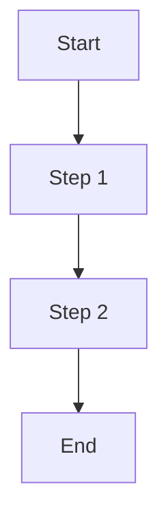
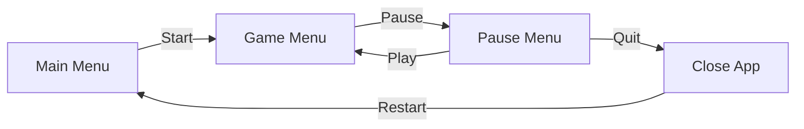

Flowcharts represent processes or workflows. Here's an example of a basic flowchart:

\```mermaid
graph TD
A[Start] --> B[Step 1]
B --> C[Step 2]
C --> D[End]
\```


## How to Use
- Use `graph TD` for top-down layouts.
- Use `graph LR` for left-right layouts.
- Nodes can have labels within `[ ]`.
- Arrows `-->` connect nodes.
- Arrows can have labels within `| |`.

I will play around with those rules to make a diagram of a typical video game's user flow.

Here is the markdown for that diagram.

\```mermaid
graph LR
A[Main Menu] -->|Start| B[Game Menu]
B -->|Pause| C[Pause Menu]
C -->|Play| B
C -->|Quit| D[Close App]
\```
