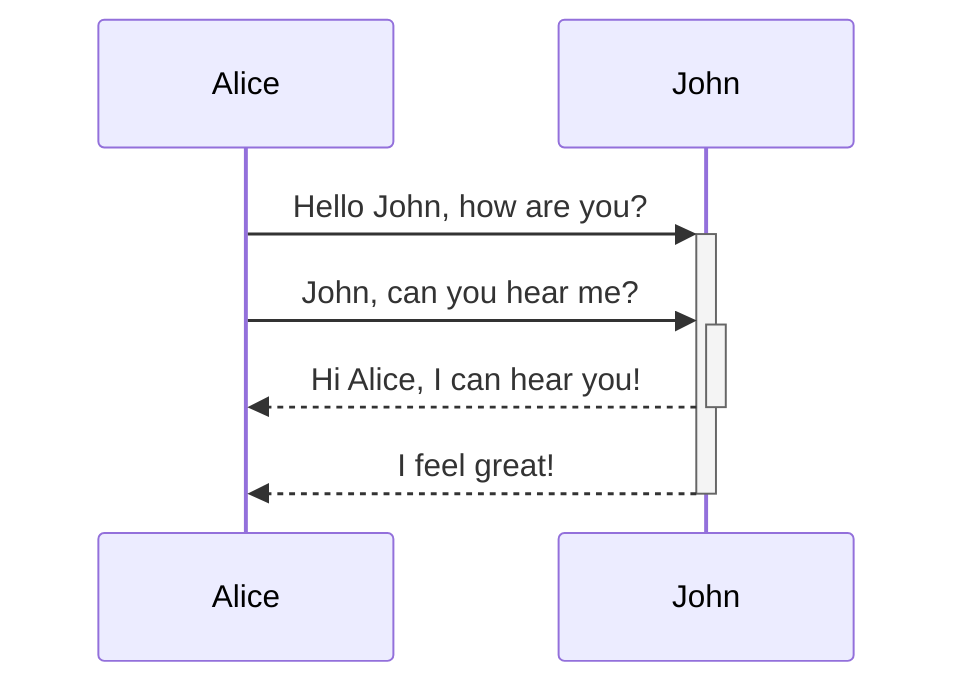
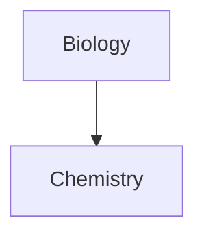

# Mermaid Diagrams

Mermaid diagrams are a tool for creating diagrams and visualizations from plain text. They are highly useful for documentation and workflows in Markdown-supported tools like Obsidian.

## Diagram Types
- [Flowcharts](Flowcharts.md)
- [Sequence Diagrams](Sequence%20Diagrams.md)
- [Gantt Charts](Gantt%20Charts.md)
- [Class Diagrams](Class%20Diagrams.md)
- [State Diagrams](State%20Diagrams.md)
- [Pie Charts](Pie%20Charts.md)
- [Entity-Relationship Diagrams](Entity-Relationship%20Diagrams.md)

## How to Use in Obsidian
1. Open a note.
2. Use a code block with `mermaid` as the language, here is a top down (td) graph:
   \```mermaid
   graph TD
   A[Start] --> B[Step 1]
   B --> C[Step 2]
   C --> D[End]
   \```
   And here is what it looks like:
```mermaid
   graph TD
   A[Start] --> B[Step 1]
   B --> C[Step 2]
   C --> D[End]
   ```
Here is a left right (lr) graph of the same data.
   \```mermaid
   graph TD
   A[Start] --> B[Step 1]
   B --> C[Step 2]
   C --> D[End]
   \`
```mermaid
   graph LR
   A[Start] --> B[Step 1]
   B --> C[Step 2]
   C --> D[End]
```

1. Preview the note to see the rendered diagram.
## References
- [Mermaid Official Documentation](https://mermaid-js.github.io/)


## Diagram
You can add diagrams and charts to your notes, using [Mermaid](https://mermaid-js.github.io/). Mermaid supports a range of diagrams, such as [flow charts](https://mermaid.js.org/syntax/flowchart.html), [sequence diagrams](https://mermaid.js.org/syntax/sequenceDiagram.html), and [timelines](https://mermaid.js.org/syntax/timeline.html).

You can also try Mermaid's [Live Editor](https://mermaid-js.github.io/mermaid-live-editor) to help you build diagrams before you include them in your notes.

To add a Mermaid diagram, create a `mermaid` [code block](https://help.obsidian.md/Editing+and+formatting/Basic+formatting+syntax#Code%20blocks).
````md

````


JohnAliceJohnAliceHello John, how are you?John, can you hear me?Hi Alice, I can hear you!I feel great!
````md

````


### Linking files in a diagram

You can create [internal links](https://help.obsidian.md/Linking+notes+and+files/Internal+links) in your diagrams by attaching the `internal-link` [class](https://mermaid.js.org/syntax/flowchart.html#classes) to your nodes.

````md

````


Internal links from diagrams don't show up in the [Graph view](https://help.obsidian.md/Plugins/Graph+view).
If you have many nodes in your diagrams, you can use the following snippet.

````md

````


This way, each letter node becomes an internal link, with the [node text](https://mermaid.js.org/syntax/flowchart.html#a-node-with-text) as the link text.